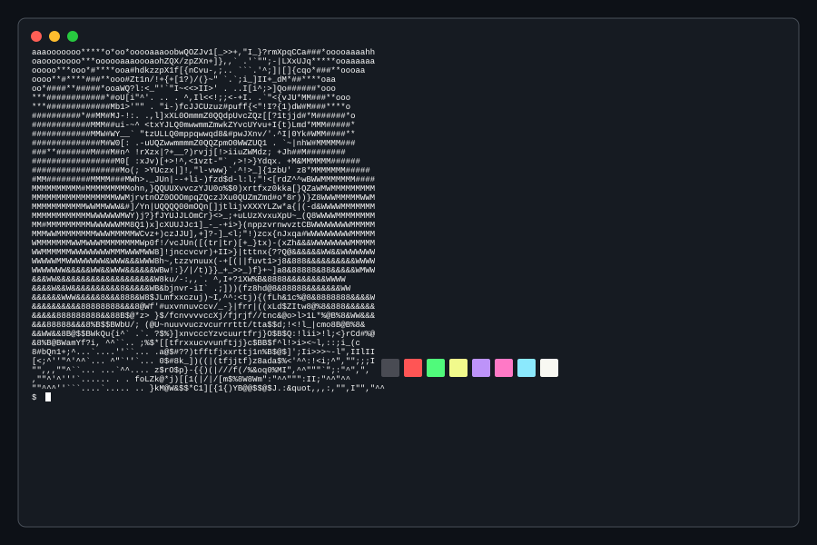

  <picture>
    <source media="(prefers-color-scheme: dark)" srcset="assets/dark_mode.svg" />
    <source media="(prefers-color-scheme: light)" srcset="assets/light_mode.svg" />
    
  </picture>

 

  
  &nbsp;
  

